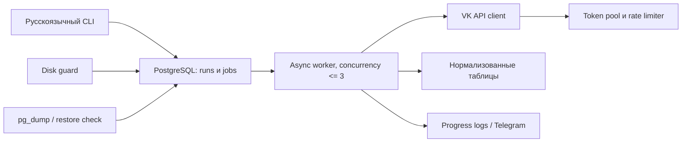
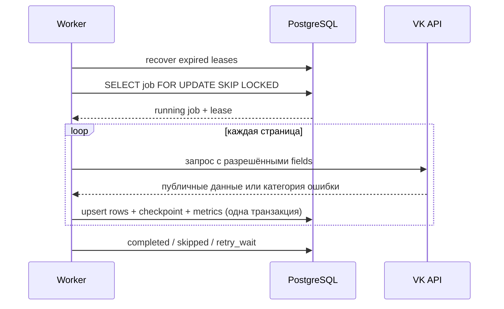
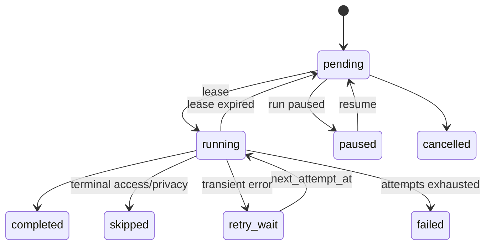
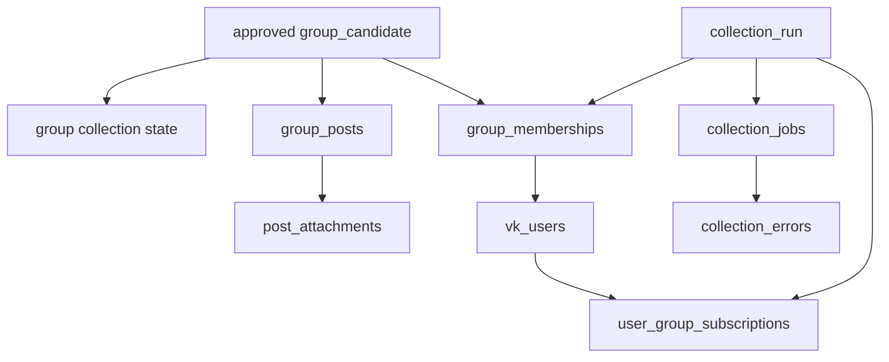

# Архитектура второго этапа

## Компоненты

PostgreSQL хранит очередь, lease, checkpoints и нормализованные данные. Один лёгкий
async worker использует общий `httpx.AsyncClient`, глобальный semaphore и существующий
token pool с per-token RPS/cooldown. CLI планирует, запускает, приостанавливает,
возобновляет, проверяет и выводит статистику. Контроль диска запрещает тяжёлое
планирование выше 85% и ставит run на паузу выше 95%. Telegram — необязательный
best-effort канал; его сбой не влияет на транзакцию.

## Выполнение задания

## Надёжность

Lease содержит `locked_at`, `locked_by` и heartbeat. Перед захватом worker возвращает
просроченные jobs в pending. Retry использует 1, 5, 15, 60 и 360 минут с jitter;
permission/private/deleted не повторяются. SIGTERM прекращает захват новых jobs,
завершает текущую page transaction и закрывает HTTP/DB connections. Ни одна операция
не держит транзакцию на весь scope.

Backup создаётся перед schema/pilot/main run, проверяется `pg_restore --list` и не
коммитится. После сбоя контейнер запускается обычной командой `collection resume`, затем
`collection run --run-id ... --until-idle`; checkpoint исключает повтор уже сохранённых
страниц.
